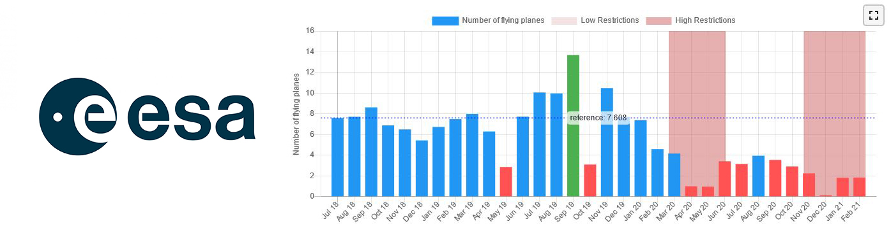

### European Space Agency RACE (Rapid Action on coronavirus and Earth Observation)

#### Changes in Airports traffic (flying planes) 

Disclaimer : data are publicly available and provided by the European Space Agency via the RACE dashboard at the following link https://race.esa.int/?poi=IT13-E13d&country=IT&indicator=E13d

Air traffic is of particular interest to unveil human and economic activities (e.g., travel, tourism, cargo) and track disease spread due to in-flight transmission. This indicator is based on the detection of flying airplanes in images captured by the Copernicus Sentinel-2 satellites. The analysis it is focused on Areas Of Interest (AOI) around the 30 busiest airports (i.e., airports with the highest number of passengers in 2019) in the EU. The chosen airports cover 26 different cities and 18 different countries. Each AOI is defined as a rectangle with 1.05° of width and 0.7° of height centered at the latitude and longitude coordinates of the target airport. This results in an area of about 6,000 km2 (equivalent to 840,000 soccer fields) per AOI. Airplane counts from satellite images of the same AOI are combined into monthly observations. It is used a history of observations from Jul/2018 to Dec/2019 for all airports to establish reference values, which are later used to determine whether the current traffic of an airport is low, normal, or high.
