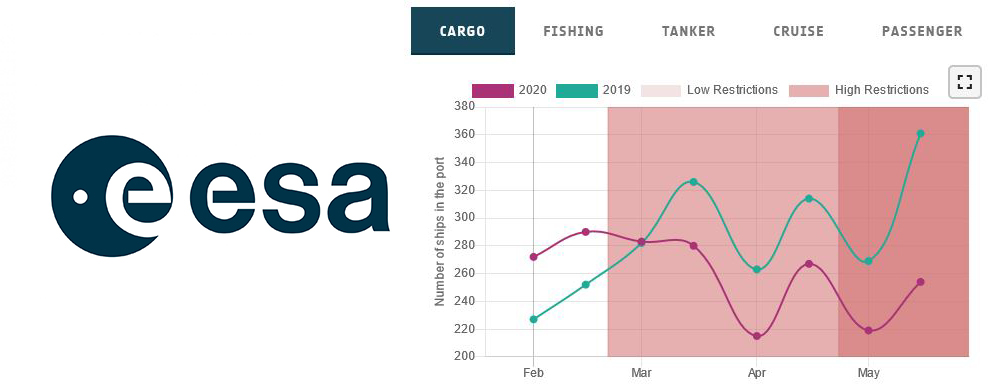

### European Space Agency RACE (Rapid Action on coronavirus and Earth Observation)

#### Changes in the number of boats in ports

Disclaimer : data are publicly available and provided by the European Space Agency via the RACE dashboard at the following link https://race.esa.int/?poi=IT3-E13e&country=IT&indicator=E13e

The current pandemic is applying a strong pressure on global production capacities and global supply chains. In fact, it has been reported that the sanitary crisis has created a supply shock across the markets, causing severe supply chain disruption. In particular, the global maritime industry has been impacted directly by the preventive and containment measures imposed by government that have blocked many port activities and workers, and indirectly by the decreased demand for commodities and raw materials. The economy lockdown and the slowdowns, due to increased border control and sanitary measures across regions, have made road transportation and distribution services more difficult and have induced a labor’s and workers’ shortage.

This indicator shows how the number of different types of boats have changed between 2019 and 2020. The type of boats selected varies for different ports, in order to show the most relevant changes. In fact, for some ports, ad Port of Genova, a great source of income is related with pleasure boats and its passengers, while for other ports, as Port of Gioia Tauro, the highest source of income is related with worldwide cargo boats commerce.

The indicators thus report the number of boats for each kind in the port area for 2019 and 2020 in different colors. It is interesting also to study the percentage decrease of the number of boats, because it shows clearly how much the COVID-19 virus and the related national restriction impacted on the transit of boats. In the first image it is reported the percentage decrease of the fishing boats for the port of Genova. It is evident that, because of the restrictions after the end of February, the number of boats in the port dropped in 2020, with respect to 2019. The same trend is evident also for pleasure boats.
