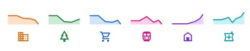

### How travel has changed due to COVID-19 

Disclaimer : data are provided by Google and are publicly available at the following link https://www.google.com/covid19/mobility/

Google Maps uses aggregated and anonymous data to show how crowded certain places are, so as to identify for example the peak hours of a shop: the health authorities have told us that this same type of aggregated and anonymized data could be useful for making critical decisions. in the fight against COVID-19.

In responding to the COVID-19 pandemic in every part of the world, attention has grown more and more towards public health strategies, such as social distancing measures, in order to slow down the transmission speed or plan the reopening in the areas. subject to travel restrictions. 
