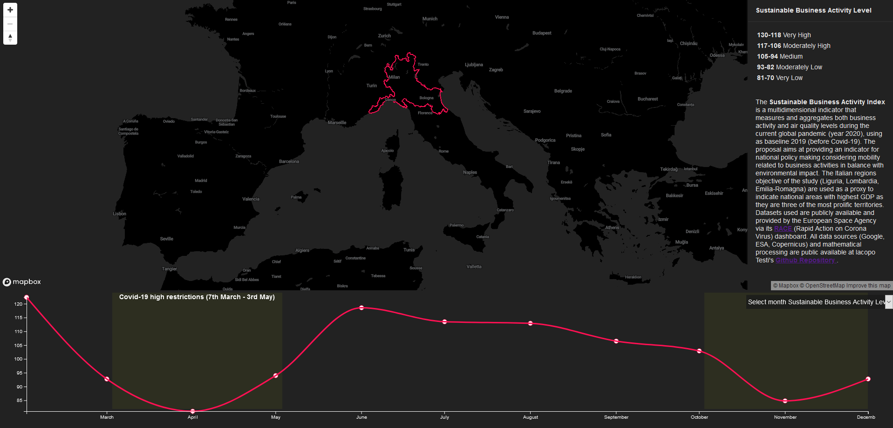

### Sustainable Business Activity during Covid-19

#### Introduction
The Sustainable Business Activity Index is a multidimensional indicator that measures and aggregates both business activity and air quality levels during the current global pandemic (year 2020), using as baseline 2019 (before Covid-19). The proposal aims at providing an indicator for national policy making considering mobility related to business activities in balance with environmental impact. The Italian regions objective of the study (Liguria, Lombardia, Emilia-Romagna) are used as a proxy to indicate national areas with highest GDP as they are three of the most prolific territories. Datasets used are publicly available and provided by the European Space Agency via its RACE (Rapid Action on Corona Virus) dashboard (link here https://race.esa.int/?country=IT). All data sources (Google, ESA, Copernicus) and mathematical processing are public available inside this Github Repository. 

#### Data Sources

- Google mobility report data (description here https://github.com/IacopoTesti/Sustainable_Business_Activity_Covid19/tree/main/Data_sources/Google_mobility_data)
- European Space Agency data (description here https://github.com/IacopoTesti/Sustainable_Business_Activity_Covid19/tree/main/Data_sources/ESA_flying_airplanes)
- Copernicus data (description here https://github.com/IacopoTesti/Sustainable_Business_Activity_Covid19/tree/main/Data_sources/Copernicus_AirQuality_data)
- National Statistics Institute data (description here https://github.com/IacopoTesti/Sustainable_Business_Activity_Covid19/tree/main/Data_sources/Italy_regions)

Find the Sustainable Business Activity visualization here https://iacopotesti.github.io/Sustainable_Business_Activity_Covid19/

